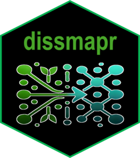

# dissmapr 

<!-- badges: start -->
[](https://www.repostatus.org/#wip)
[](https://github.com/b-cubed-eu/dissmapr/actions/workflows/R-CMD-check.yaml)
[](https://app.codecov.io/gh/b-cubed-eu/dissmapr)
<!-- badges: end -->

dissmapr is an R package that provides a complete workflow for computing and mapping biodiversity turnover at the macroscale. It wraps zeta diversity computation, multi-site generalised dissimilarity modelling (MS-GDM), spatial prediction of compositional turnover, and bioregion delineation into a streamlined, reproducible pipeline.

## Installation

You can install the development version of dissmapr from [GitHub](https://github.com/b-cubed-eu/dissmapr) with:

```r
# install.packages("remotes")
remotes::install_github("b-cubed-eu/dissmapr")
```

## Usage

The dissmapr workflow consists of the following steps:

### 1. Import and grid occurrence data

```r
library(dissmapr)

# Import occurrence records
occ <- get_occurrence_data(
  data = "my_occurrences.csv",
  source_type = "local_csv"
)

# Format to wide (site x species) layout
wide <- format_df(
  data = occ,
  format = "long",
  x_col = "x",
  y_col = "y",
  species_col = "species",
  value_col = "count"
)

# Generate a spatial grid
grid <- generate_grid(
  data = wide$site_spp,
  x_col = "x",
  y_col = "y",
  grid_size = 0.5,
  sum_cols = 4:ncol(wide$site_spp)
)
```

### 2. Retrieve environmental data

```r
env <- get_enviro_data(
  data = grid$grid_spp,
  source = "geodata",
  var = "bio",
  res = 2.5
)

# Remove correlated predictors
env_reduced <- rm_correlated(env$env_df, threshold = 0.7)
```

### 3. Fit zeta diversity models

```r
results <- run_ispline_models(
  spp_df = grid$grid_spp_pa[, sp_cols],
  env_df = env_reduced,
  xy_df = grid$grid_spp[, c("centroid_lon", "centroid_lat")],
  orders = 2:6,
  sam = 100
)

# Visualise ispline partial effects
plot_ispline_lines(results$ispline_table, x_var = "distance")
plot_ispline_boxplots(results$ispline_table)
```

### 4. Predict turnover and map bioregions

```r
# Predict pairwise compositional turnover
pred <- predict_dissim(
  grid_spp = grid$grid_spp_pa,
  species_cols = sp_cols,
  env_vars = env_reduced,
  zeta_model = results$zeta_gdm_list$Order2,
  grid_xy = grid$grid_spp[, c("centroid_lon", "centroid_lat")]
)

# Cluster into bioregions
bioreg <- map_bioreg(
  data = pred,
  scale_cols = c("pred_zetaExp", "centroid_lon", "centroid_lat"),
  method = "all",
  k_override = 5
)

# Map bioregional change between scenarios
change <- map_bioreg_diff(bioreg$nn$current, approach = "all")
```

## Tutorials

Detailed tutorials are available on the [pkgdown site](https://b-cubed-eu.github.io/dissmapr/):

1. **Getting started** - data import and formatting
2. **User-defined grid** - spatial gridding of occurrences
3. **Environmental data** - retrieving and preparing environmental predictors
4. **Zeta diversity** - computing zeta diversity metrics
5. **Zeta-MSGDM** - fitting ispline models with dissmapr
6. **Predict turnover** - predicting compositional turnover
7. **Map bioregions** - clustering and mapping bioregions
8. **Map change** - quantifying bioregional change
9. **Compute orderwise** - examples of order-wise metric computation

## Meta

- We welcome [contributions](https://b-cubed-eu.github.io/dissmapr/CONTRIBUTING.html) including bug reports.
- License: [MIT](LICENSE.md)
- Get citation information for dissmapr in R doing `citation("dissmapr")`.
- Please note that this project is released with a [Contributor Code of Conduct](https://b-cubed-eu.github.io/dissmapr/CODE_OF_CONDUCT.html). By participating in this project you agree to abide by its terms.

## Acknowledgments

This software was developed with funding from the European Union's Horizon Europe Research and Innovation Programme under grant agreement ID No [101059592](https://doi.org/10.3030/101059592).
